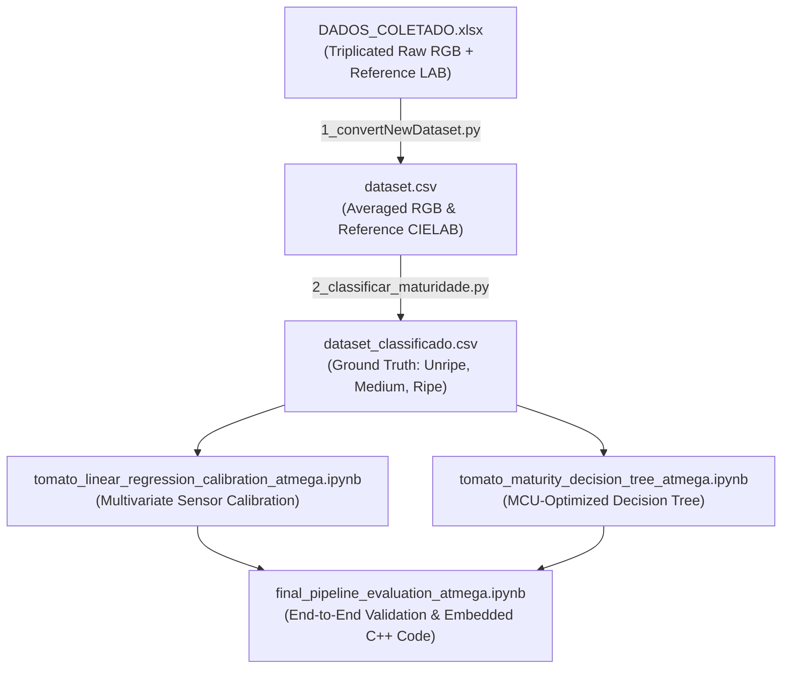

# Dataset and Reproduction Pipeline: Tomato Maturity Classification via Low-Cost Optical Sensor and Microcontroller

This repository provides the full data processing pipeline, colorimetric calibration models, decision tree algorithms optimized for microcontrollers (ATmega/Arduino), raw sensor datasets, and high-resolution photographic records used in the study.

The source code and datasets made available here ensure the **full end-to-end scientific reproduction of the published paper**, while serving as an open photographic and spectral benchmark for future research in computer vision, precision agriculture, and embedded edge sensing.

---

## 📌 Table of Contents
- [Repository Structure](#-repository-structure)
- [Correlation Between Tomato Photos and Dataset](#-correlation-between-tomato-photos-and-dataset)
- [Scientific Reproduction Pipeline](#-scientific-reproduction-pipeline)
- [Requirements and Installation](#-requirements-and-installation)
- [Terms of Use and Citation](#-terms-of-use-and-citation)

---

## 📂 Repository Structure

```text
color_sensor_tomatoes/
├── DADOS_COLETADO.xlsx                               # Raw dataset containing triplicated RGB and CIELAB readings with ID_FOTO
├── dataset.csv                                       # Averaged and normalized RGB and CIELAB reference values
├── dataset_classificado.csv                          # Labeled dataset with maturity stages (Unripe, Medium, Ripe)
├── 1_convertNewDataset.py                            # Preprocessing script: replicates averaging and color space conversion
├── 2_classificar_maturidade.py                       # K-Means clustering script to generate maturity ground-truth labels
├── tomato_linear_regression_calibration_atmega.ipynb # Multivariate optical calibration training (Sensor RGB -> CIELAB)
├── tomato_maturity_decision_tree_atmega.ipynb        # MCU-compatible decision tree induction and threshold pruning
├── final_pipeline_evaluation_atmega.ipynb            # End-to-end validation of the embedded pipeline and firmware generation
├── photos_tomato/                                    # High-resolution tomato photographs (1.jpg, 2.jpg, ...)
├── calibration_figures/                              # Visualizations and regression diagnostics for optical calibration
├── figures/                                          # CIELAB chromaticity distributions and cluster visualizations
├── pipeline_figures/                                 # 300 DPI confusion matrices and performance benchmarks
└── prototype_device/                                 # Mechanical designs and hardware prototypes
```

---

## 🍅 Correlation Between Tomato Photos and Dataset

All photographs located in the [`photos_tomato/`](./photos_tomato) directory are directly mapped to the **`ID_FOTO`** column in the master dataset [`DADOS_COLETADO.xlsx`](./DADOS_COLETADO.xlsx):

- File `photos_tomato/{ID}.jpg` corresponds to the tomato sample indexed by `ID_FOTO == {ID}`.
- For every fruit, **3 consecutive optical readings** were acquired with the low-cost color sensor (`R1, G1, B1`, `R2, G2, B2`, `R3, G3, B3`), accompanied by **3 reference measurements** obtained using a commercial spectrophotometer in the CIELAB color space (`LAB_L1, LAB_A1, LAB_B1`, etc.).
- These high-resolution images are freely contributed to the scientific community for future studies, including semantic segmentation, deep convolutional neural networks (CNNs), and photometric analysis.

---

## ⚙️ Scientific Reproduction Pipeline

The experimental reproduction workflow follows the sequential architecture below:



### Execution Steps:

1. **Raw Data Ingestion & Preprocessing:**
   Run [`1_convertNewDataset.py`](./1_convertNewDataset.py) to compute mean triplicated readings per sample and transform the raw RGB space into reference CIELAB ($D_{65}, 2^\circ$).
   ```bash
   python 1_convertNewDataset.py
   ```

2. **Ground-Truth Maturity Classification:**
   Run [`2_classificar_maturidade.py`](./2_classificar_maturidade.py) to perform K-Means clustering ($k=3$) ordered by the chromatic index $a^*$ (green $\rightarrow$ yellowish/intermediate $\rightarrow$ red), establishing the classification labels: `Unripe`, `Medium`, and `Ripe`.
   ```bash
   python 2_classificar_maturidade.py
   ```

3. **Colorimetric Calibration (Sensor $\rightarrow$ True CIELAB):**
   Open and execute [`tomato_linear_regression_calibration_atmega.ipynb`](./tomato_linear_regression_calibration_atmega.ipynb) to train the multivariate linear regression models designed for efficient floating-point execution on 8-bit and 32-bit microcontrollers.

4. **Decision Tree Induction & MCU Optimization:**
   Open and execute [`tomato_maturity_decision_tree_atmega.ipynb`](./tomato_maturity_decision_tree_atmega.ipynb) to train and prune the decision tree model into minimal boolean logic (`if-else` rules).

5. **Integrated Pipeline Validation:**
   Open and execute [`final_pipeline_evaluation_atmega.ipynb`](./final_pipeline_evaluation_atmega.ipynb) to generate the publication-ready confusion matrices (300 DPI), comprehensive classification reports ($F_1$-score, precision, recall), penalty evaluations, and the embedded C++/Arduino firmware implementation.

---

## 💻 Requirements and Installation

Recommended environment: **Python 3.8+**

```bash
pip install pandas numpy scikit-learn scikit-image matplotlib seaborn openpyxl jupyter
```

---

## 📜 Terms of Use and Citation

The data, source code, and images in this repository are publicly available for academic, research, and educational purposes under the condition of **mandatory attribution and formal citation** of the associated research paper and Zenodo data repository.

If you use this dataset, photographs, or software in your work, please cite:

### Research Paper
> **Authors:** [Insert Paper Authors]  
> **Title:** [Insert Scientific Paper Title]  
> **Journal:** [Insert Journal / Conference Name], Year.  
> **Paper DOI:** [`https://doi.org/10.xxxx/xxxxx`](https://doi.org/10.xxxx/xxxxx)

### Zenodo Dataset Repository
> **Zenodo DOI:** [`https://doi.org/10.5281/zenodo.xxxxxxx`](https://doi.org/10.5281/zenodo.xxxxxxx)

```bibtex
@article{tomato_color_sensor_paper,
  author    = {Author Name and Coauthors},
  title     = {Title of the Published Research Article on Tomato Maturity Sensing},
  journal   = {Scientific Journal Name},
  year      = {2026},
  doi       = {10.xxxx/xxxxx}
}

@dataset{tomato_color_sensor_zenodo,
  author    = {Author Name and Coauthors},
  title     = {Dataset: Low-Cost Optical Color Sensor and Fruit Photographic Database for Embedded Tomato Maturity Classification},
  year      = {2026},
  publisher = {Zenodo},
  doi       = {10.5281/zenodo.xxxxxxx}
}
```
